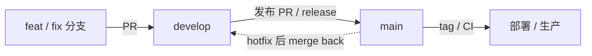

# Git 分支协作流程规范

---

## 前言

本文档约定团队在 **分支管理** 与 **协作流程** 上的统一行为，与 [Git 规范](./git.md)（提交信息、分支命名、Tag 命名）配套使用。

- **Git 规范**：回答「commit / 分支名 / tag 怎么写」。
- **本文档**：回答「main、develop、功能分支各自承担什么角色」「日常开发、发布、热修、回流应怎么走」。

### 分支模型选择说明

[Git Flow](https://nvie.com/posts/a-successful-git-branching-model/) 的作者已在 2020 年公开表示，该模型 **不适合** 以持续交付为主的现代软件工程。本规范提供两种可选方案：

| 方案 | 名称 | 适用场景 |
|------|------|----------|
| **方案 A** | [GitHub Flow](https://docs.github.com/en/get-started/using-github/github-flow) | 持续部署、小中型团队、单主干即可满足发布节奏 |
| **方案 B** | 简化双分支（`main` + `develop`） | 固定迭代窗口、需集成分支承接多人并行、发布前批量验收 |

团队应在项目启动时 **选定一种方案并写入 README**，全项目统一，避免混用两套规则。

> 下文默认生产主干分支名为 `main`；若仓库仍使用 `master`，语义等同，仅需在保护规则与 CI 中保持一致。

---

## 核心原则

### 单一生产真相源

`main` 分支代表 **已与线上（或预发「生产等价」环境）对齐、可随时部署** 的代码。除经评审的合并外，任何人不得向共享 `main` 直接推送业务改动。

### 代码流向

```
功能分支 (feat-* / fix-*)
    → [develop]（方案 B 可选）
    → main
    → 部署 / 打 Tag
```

**禁止** 长期在 `main` 上直接开发功能；**禁止** 对共享 `main` 执行 `git push --force`。

### 与 Git 规范的衔接

- 功能分支命名：`{type}-{issue-id}-description`，见 [Git 规范 - 分支命名](./git.md#分支命名)。
- 提交信息：遵循 Conventional Commits，见 [Git 规范 - 提交日志](./git.md#git-提交日志格式规范)。
- 发布标记：合并 `main` 后打 `v{semver}` 附注标签，见 [Git 规范 - Tag 命名](./git.md#git-tag-命名规范)。

---

## 分支角色定义

| 分支类型 | 生命周期 | 职责 | 是否部署生产 |
|----------|----------|------|----------------|
| `main` | 常驻 | 生产主干；仅通过 PR/MR 合入 | 是（默认） |
| `develop` | 常驻（仅方案 B） | 下一版本集成分支 | 否（可对接预发） |
| `feat-*` / `fix-*` 等 | 短命 | 单次需求或缺陷 | 否 |
| `release-*`（可选） | 短命 | 发布前冻结、修发布级问题（方案 B） | 视团队而定 |
| `{version}-stable` | 常驻（多版本维护时） | 并行维护的历史大版本 | 视版本策略 |

`develop` **不是** 第二条生产主干；它只是集成缓冲，最终仍须合并进 `main` 才能视为正式发布。

---

## 方案 A：GitHub Flow

### 模型结构

```
main (protected，始终可部署)
  ↑  PR 合并
feat-xxx / fix-xxx（从 main 拉出，合并回 main）
```

**特点**：无长期 `develop`；发布 = 合入 `main` + 打 Tag + 触发部署流水线。

### A.1 日常功能开发

1. 从最新 `main` 创建功能分支：

```bash
git checkout main
git pull origin main
git checkout -b feat-123-user-login
```

2. 在功能分支上小步提交（符合 Conventional Commits）。

3. 推送并创建 Pull Request，**目标分支为 `main`**：

```bash
git push -u origin feat-123-user-login
```

4. 通过 Code Review 与 CI 后，在平台上合并 PR（推荐 **Squash merge** 以保持 `main` 历史简洁，团队需统一策略）。

5. 合并后删除远程/本地功能分支，本地更新 `main`：

```bash
git checkout main
git pull origin main
git branch -d feat-123-user-login
```

### A.2 发布与部署

1. `main` 上待发布 commit 已合并完毕，CI 通过。
2. 在 `main` 上打附注标签并推送：

```bash
git checkout main
git pull origin main
git tag -a v1.2.0 -m "发布用户登录模块"
git push origin v1.2.0
```

3. 由 CI/CD 监听 `main` 或 Tag 触发部署；`CHANGELOG` 生成方式见 [CHANGELOG 规范](./changelog.md)。

### A.3 生产热修复（Hotfix）

热修复 **必须从 `main` 拉出**，合并回 `main` 后部署；方案 A 无 `develop`，无需回流。

```bash
git checkout main
git pull origin main
git checkout -b fix-456-payment-crash

# 修复、测试、提交
git push -u origin fix-456-payment-crash
# PR → main，合并后部署

# 视需要打 patch 版本 Tag
git tag -a v1.2.1 -m "修复支付崩溃"
git push origin v1.2.1
```

### A.4 流程示意


---

## 方案 B：简化双分支（main + develop）

### 模型结构

```
main (生产)
  ↑  release / hotfix 合并
develop (集成分支)
  ↑  feat / fix 合并
feat-xxx / fix-xxx
```

**特点**：日常功能先进 `develop` 集成；经测试后再 **develop → main** 发布；热修复先进 `main`，再 **回流 develop**。

### B.1 日常功能开发

1. 从最新 `develop` 创建功能分支：

```bash
git checkout develop
git pull origin develop
git checkout -b feat-123-user-login
```

2. 开发、提交、推送，创建 PR，**目标分支为 `develop`**。

3. Review 与 CI 通过后合并，删除功能分支。

4. 定期将 `main` 上的热修复同步到 `develop`（见 B.4），避免集成分支漂移。

### B.2 发布（develop → main）

在 `develop` 达到发布标准（测试通过、版本范围确定）后：

**方式一：直接 PR（小团队常用）**

```bash
# 在平台上创建 PR：develop → main
# 合并前确认 develop 已 merge 过最新的 main（含 hotfix）
```

**方式二：可选 release 分支（发布窗口内需冻结时）**

```bash
git checkout develop
git pull origin develop
git checkout -b release-1.2.0

# 仅允许修复级 commit（fix、chore 等），禁止新 feat
# 测试通过后：

git checkout main
git pull origin main
git merge release-1.2.0
git push origin main

git tag -a v1.2.0 -m "发布 1.2.0"
git push origin v1.2.0

# 将 release 合并回 develop，并删除 release 分支
git checkout develop
git merge release-1.2.0
git push origin develop
```

### B.3 生产热修复（Hotfix）

热修复 **必须从 `main` 拉出**，**必须先合入 `main` 并部署**，再回流 `develop`。

```bash
git checkout main
git pull origin main
git checkout -b fix-456-payment-crash

# 修复、测试、提交、推送
# PR → main，合并、部署

git checkout develop
git pull origin develop
git merge main          # 将 main 上的热修复同步到 develop
git push origin develop
```

> **必须回流**：若只修 `main` 不同步 `develop`，下一次 `develop → main` 可能重新引入已修复的缺陷，或产生大量冲突。

### B.4 保持 develop 与 main 同步

在每次 hotfix 合入 `main` 后，以及大版本发布前，执行：

```bash
git checkout develop
git pull origin develop
git merge main
git push origin develop
```

若仅需同步单个 commit，可使用 `cherry-pick`：

```bash
git checkout develop
git cherry-pick <commit-sha>
git push origin develop
```

### B.5 流程示意



---

## main 分支管理

### 保护规则（推荐在 Git 平台配置）

- 禁止直接 push（Require pull request）
- 要求至少 1 人 Review（可按仓库调整）
- 要求 CI / 状态检查通过
- 禁止 force push
- 可选：要求分支为最新（Require branches to be up to date）

### 合并策略

团队统一选择一种并在文档中写明：

| 策略 | 优点 | 缺点 |
|------|------|------|
| **Squash merge** | `main` 历史一条 PR 一 commit，易读 | 丢失分支内细粒度 commit |
| **Merge commit** | 保留完整历史 | 历史较杂 |
| **Rebase merge** | 线性历史 | 需熟悉 rebase，冲突处理在 PR 阶段完成 |

### 发布节奏

- 每次合入 `main` 的变更应处于 **可部署** 状态（功能开关 / 未完成特性勿合入）。
- 正式发布以 **Tag** 标记；部署流水线可监听 `main` 或 `v*` Tag。

---

## develop 分支管理（方案 B）

- 允许较快合入功能 PR，但 **CI 必须通过**。
- **不得** 将未经验证、不可发布的实验代码长期留在 `develop`（可用功能开关或独立分支）。
- 发布前执行 `merge main → develop`，解决冲突后再 `develop → main`。
- `develop` 不替代 `main` 作为生产部署源，除非团队明确有仅跟踪 `develop` 的预发环境（且仍须区分环境）。

---

## 功能分支管理（方案 A / B 通用）

1. **一事一分支**：一个分支对应一个 Issue / 需求 / 缺陷，避免「大杂烩」分支。
2. **短命**：合并后立即删除远程分支。
3. **及时同步上游**：开发周期较长时，定期将目标基线（`main` 或 `develop`）合并入功能分支：

```bash
git checkout feat-123-user-login
git fetch origin
git merge origin/develop   # 方案 B；方案 A 改为 origin/main
```

4. **禁止** 在功能分支上 `rebase` 已推送到共享仓库且他人可能基于其工作的历史（除非团队明确约定）。

---

## 异常场景与补救

### 误在本地 main 上提交了尚未 push 的改动

将提交挪到功能分支，恢复 `main` 与远程一致：

```bash
git branch fix-local-work        # 保留当前提交
git fetch origin
git reset --hard origin/main

# 方案 B：合入 develop
git checkout develop
git merge fix-local-work
git push origin develop

# 若需上生产：再提 PR fix-local-work → main
```

### 误 push 到远程 main

1. **不要** 擅自 `force push`。
2. 通知团队，在 `develop`（方案 B）或各活跃功能分支上 `merge origin/main` 或 `cherry-pick` 所需 commit。
3. 与负责人评估是否在 `main` 上 **revert** 错误合并，再通过正规 PR 重新合入。

### 功能已合 develop 但发布前要撤回

- 优先在 `develop` 上 **revert** 对应 merge commit，而不是改写历史。
- 已进 `main` 的撤回同样使用 revert，保证历史可追溯。

### 方案 B：develop 与 main 长期分叉

1. 冻结新功能合入，优先 `git merge main` 进 `develop` 解决冲突。
2. 发布窗口内可临时使用 `release-*` 分支收敛。
3. 事后复盘：加强 hotfix 回流与发布前同步流程。

---

## 多版本并行维护

当项目需同时维护多个大版本时，不宜仅依赖单一 `main`。可为每个维护中的大版本保留稳定分支，例如：

- `1.0.0-stable`
- `2.0.0-stable`

命名与说明见 [Git 规范 - 多版本分支命名](./git.md#多版本分支命名)。热修复在对应 `-stable` 分支上进行，并按需 cherry-pick 到更高版本分支及 `main` / `develop`。

---

## 协作检查清单

### 应该做

- [ ] 开工前 `git pull` 更新基线分支
- [ ] 所有业务改动经功能分支 + PR
- [ ] 方案 B：hotfix 合 `main` 后 **merge 回 develop**
- [ ] 合并前 CI 通过，发布打 semver Tag
- [ ] 合并后删除已关闭的功能分支

### 不应该做

- [ ] 在本地 `main` 上长期开发并保留未同步的 commit
- [ ] 未经 PR 直接向共享 `main` push
- [ ] 方案 B：只合 `develop` 不合 `main` 却认为已上线
- [ ] `develop` 长期不合并 `main` 上的热修复
- [ ] 对共享主干 `git push --force`

---

## 方案选型建议

| 条件 | 推荐 |
|------|------|
| 持续部署、每日可发布、团队少于 15 人 | **方案 A** |
| 固定迭代（如双周发布）、需集成测试窗口 | **方案 B** |
| 开源库、文档站、规范仓库（如本 FE_SPEC） | **方案 A** |
| 多团队并行、develop 对接预发环境 | **方案 B** |

---

## 参考资料

1. [Git 规范](./git.md)
2. [CHANGELOG 规范](./changelog.md)
3. [GitHub Flow](https://docs.github.com/en/get-started/using-github/github-flow)
4. [A successful Git branching model](https://nvie.com/posts/a-successful-git-branching-model/)（历史参考；作者已不推荐用于持续交付）
5. [Git Flow considered harmful](https://www.endoflineblog.com/gitflow-considered-harmful)（批判性阅读）
6. [Semantic Versioning](https://semver.org/lang/zh-CN/)
