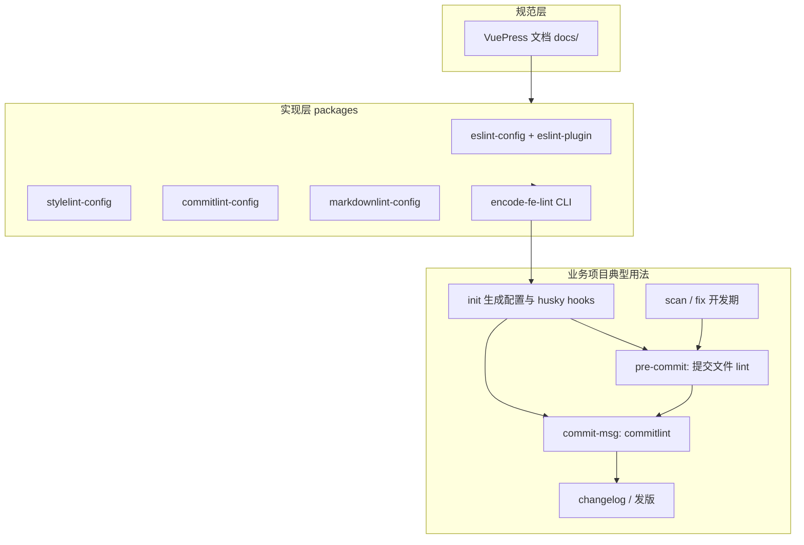

下面按 **「本仓库在整套规范里扮演什么角色」** 和 **「规范从文档到工具再到日常研发怎么转起来」** 两层说明。

---

## 中文

### 1. 这套「前端代码规范」工程是什么

本仓库 **fe-spec** 是一个 **pnpm + Lerna 的 monorepo**：一边用 **VuePress（`docs/`）** 写**可读规范**，一边产出 **npm 规则包 + 脚手架 CLI**，让别人家的业务项目能接同一套标准。

配套关系（README / 文档首页一致）大致是：

| 规范领域 | 工具 | 本仓库里的 npm 包（`packages/`） |
|----------|------|----------------------------------|
| JS / TS / Node | ESLint | `encode-fe-eslint-config`、`encode-fe-eslint-plugin` |
| CSS | stylelint | `encode-fe-stylelint-config` |
| Git 提交说明 | commitlint | `encode-fe-commitlint-config` |
| Markdown 文档 | markdownlint | `encode-fe-markdownlint-config` |
| 一键接入与卡口 | 自研 CLI | **`encode-fe-lint`**（依赖并屏蔽上述配置的复杂度） |

也就是说：**「规范」= 文档里的约定 + 各包里的规则；「落地」= 业务项目装包、写配置或用 `encode-fe-lint` 生成配置 + Git 钩子。**

---

### 2. 对外（业务项目）理想流程：`encode-fe-lint` 串起来的闭环

README 与 `docs/index.md` 描述的是 **在任意前端仓库里** 的典型路径：

1. **接入** — `encode-fe-lint init`  
   - 交互选择框架/能力（ESLint、stylelint、markdownlint、husky 等）。  
   - 生成 `.eslintrc.js`、`.stylelintrc.js`、`.markdownlint.json`、`commitlint.config.js` 等（模板在 `encode-fe-lint` 的 `src/config`）。  
   - 在 **`package.json` 里写 Husky v3 风格的 `husky.hooks`**（见 `packages/encode-fe-lint/src/actions/init.ts`）：  
     - **`pre-commit`** → `encode-fe-lint commit-file-scan`（只扫**本次提交涉及文件**）  
     - **`commit-msg`** → `encode-fe-lint commit-msg-scan` → 内部再调 **`commitlint`**  

2. **日常开发**  
   - **`encode-fe-lint scan`**：全量或指定目录扫 ESLint / stylelint / markdownlint 等。  
   - **`encode-fe-lint fix`**：同上，但带自动修复。  

3. **提交时卡口（Git）**  
   - **pre-commit**：对暂存区相关文件跑 lint，有 **error**（或 strict 模式下 warn）则 **提交失败**。  
   - **commit-msg**：校验 **Conventional Commits** 风格说明，失败则 **提交失败**。  

4. **发版 / 维护发布说明（与规范配套、但不在 CLI 里强制）**  
   - 规范文档强调 **CHANGELOG.md** 的写法；本 monorepo 根目录用 **`pnpm run changelog`**（`conventional-changelog`）从 **已规范的 git 历史** 去更新 `CHANGELOG.md`。  
   - **Lerna**（`lerna publish`）负责多包版本与发 npm，与「代码风格 lint」是另一条线。

整体上：**文档定义「什么是好代码」→ 各 `*-config` 包把规则固化成配置 → `encode-fe-lint` 负责安装、模板、扫描、修复和 Git 卡点 → commit 历史再支撑 changelog。**

---

### 3. 对本仓库（fe-spec）自己：怎么「运作」

本仓库 **既是规范产地，也是部分能力的消费者**，和「完整 init 一套 encode-fe-lint」并不完全一样：

- **文档**：`pnpm docs:dev` / `docs:build`，规范在 `docs/` 里维护。  
- **根目录脚本**：例如 `lint` 只跑 `markdownlint README.md`；`changelog` 更新根 `CHANGELOG.md`。  
- **Husky**：当前 `.husky` 里主要是 **`commit-msg` → `npx commitlint`**（和 `commitlint.config.js` 继承本地 `packages/commitlint-config` 一致）。  
- **没有在根仓库里配置** `encode-fe-lint` 的 `pre-commit` / `commit-file-scan`（即：**本仓库默认不会在提交前自动跑 ESLint 全链路**，与脚手架推荐给业务项目的方式不同）。  
- **多包发布**：`lerna publish`（`lerna.json`），子包各自版本；规范包发 npm 后给外部项目用。

所以：**对外的「完整流程」由文档 + `encode-fe-lint` 描述；本仓库自身更偏「维护规范包 + 文档站 + 轻量 Git 卡口（commitlint）+ 手工/脚本 markdownlint、changelog」。**

---

### 4. 一张总图（概念）

---

## English

### What this project is

**fe-spec** is a **pnpm + Lerna monorepo** that (1) documents frontend standards in **VuePress** under `docs/`, and (2) ships **shareable linter configs** plus **`encode-fe-lint`**, a CLI that bundles ESLint / stylelint / markdownlint / commitlint integration and is meant to **init**, **scan**, **fix**, and wire **Git hooks** for consumer apps.

### Intended flow in a consumer repo (the “full” pipeline)

1. **`encode-fe-lint init`** — generates config files and, in `init.ts`, sets **`husky.hooks['pre-commit']`** to **`encode-fe-lint commit-file-scan`** and **`commit-msg`** to **`encode-fe-lint commit-msg-scan`** (which shells out to **commitlint**).  
2. **Day-to-day** — **`scan`** / **`fix`** run linters (with optional paths and ignore behavior).  
3. **On `git commit`** — **pre-commit** lints **staged commit files**; **commit-msg** enforces **conventional commit messages**.  
4. **Release hygiene** — docs describe **CHANGELOG.md**; this repo’s root uses **`conventional-changelog`** via **`pnpm run changelog`**; **Lerna** handles **multi-package publish**, separate from style linting.

### How this repo itself behaves

It **authors** the packages and docs, but **dogfoods only part** of the story: root **Husky** mainly runs **`commitlint`** on **`commit-msg`**; there is **no** root **`pre-commit`** wired to **`encode-fe-lint commit-file-scan`** like the scaffold recommends for downstream projects. Root **`pnpm run lint`** only targets **`README.md`** for markdownlint.

**Bottom line:** the **documented end-to-end “frontend spec workflow”** is **docs → published configs → `encode-fe-lint` → hooks + scan/fix → changelog/release**; **this monorepo** is the **source** of that stack and uses a **slimmer subset** locally (notably **commit-msg** + manual/ script **markdownlint** / **changelog**).
